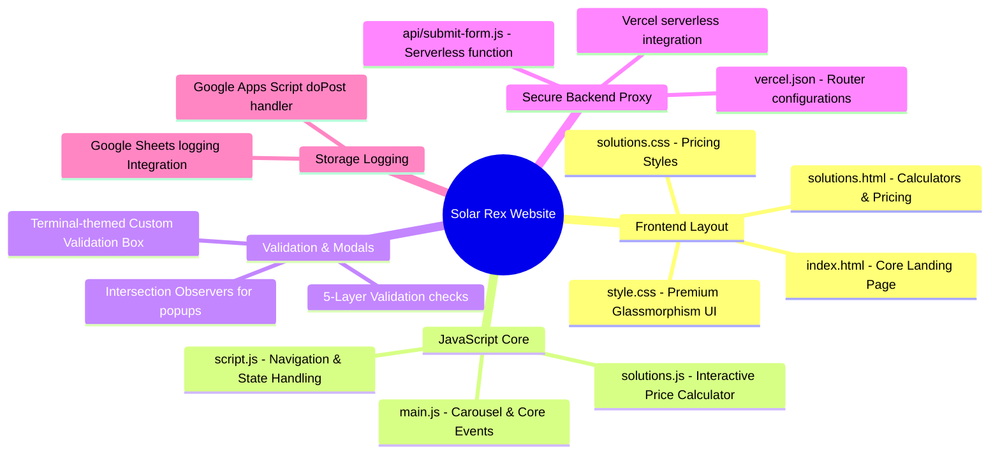
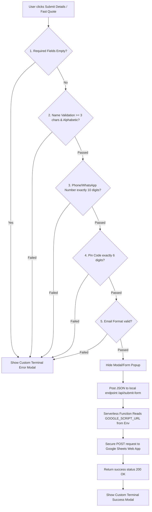

# Solar Rex Web Application

Welcome to the official repository for the **Solar Rex** web application. This project is a premium, cross-browser compatible landing page and interactive portal built using Vite, designed for solar energy solutions (Residential, Housing Societies, and Commercial). It features high-fidelity visual UI, dynamic calculators, 5 layers of input validation, and a secure serverless form logging integration with Google Sheets.

---

## Project Structure & Mind Map



---

## Form Submission Flowchart

Below is the flowchart representing the custom input validation process (5 layers of checks) and the secure backend proxy submission:



---

## Features

- **5-Layer Form Validation**: Comprehensive client-side checks for data validation (completeness, name length/type, 10-digit phone, 6-digit pin, and email syntax) before transmission.
- **Terminal-themed Alerts**: Premium, custom validation error and success feedback messages styled as a retro Unix terminal console overlay with sliding animations.
- **Security Hardening**: Secure serverless API router proxy (`api/submit-form.js`) protecting Google Sheets Apps Script endpoint URL credentials from browser inspections (Chrome Inspect Mode / DevTools / extensions).
- **Responsive Layout**: Designed with cross-browser compatibility and responsive layouts covering smart devices, tablets, and desktops.
- **Vite Build Pipeline**: Lightning-fast local development and optimized static asset packaging.

---

## Getting Started

### Prerequisites

Make sure you have Node.js installed on your machine.

### Installation

1. Clone this repository to your local system:
   ```bash
   git clone https://github.com/rp0948566-hue/SOLAR-REX-webside.git
   ```
2. Navigate into the project folder:
   ```bash
   cd SOLAR-REX-webside
   ```
3. Install the dependencies:
   ```bash
   npm install
   ```

### Local Development

Run the Vite development server locally:
```bash
npm run dev
```

### Build for Production

Compile the optimized static bundle:
```bash
npm run build
```
The compiled HTML, CSS, and JS output will be placed in the `/dist` directory.

---

## Deployment & Configuration

### 1. Google Sheets Setup

To capture form submissions:
1. Create a blank Google Sheet with the headers `Timestamp`, `Category`, `Name`, `Email`, `WhatsApp`, `Pincode`, `HousingSociety`, `CompanyName`, `City`, `Designation`, and `AverageMonthlyBill` in Row 1.
2. Go to **Extensions ➔ Apps Script**, write a POST script mapping parameters to `.appendRow()`, and deploy it as a **Web App** accessible to **Anyone**. Copy the deployed Web App URL.

### 2. Server Environment Variables

Create a `.env` file in the root directory:
```env
GOOGLE_SCRIPT_URL=your_google_script_web_app_url_here
```
When deploying to Vercel, navigate to the project dashboard and add `GOOGLE_SCRIPT_URL` to **Settings ➔ Environment Variables**.

---

## License

This project is licensed under the MIT License - see the [LICENSE](LICENSE) file for details.
